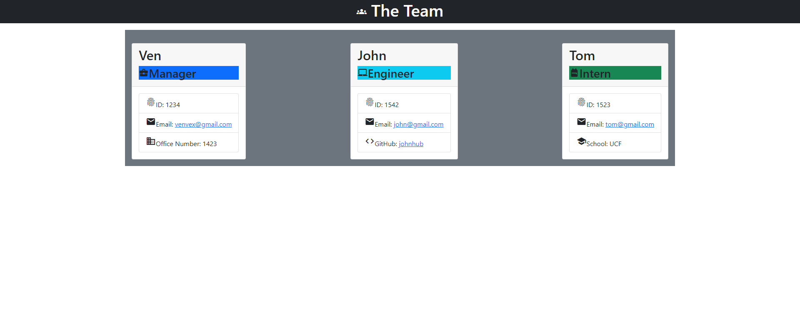

# Team Profile Generator

## Table of Contents
- [Description](#description)
- [Installation](#installation)
- [How to Use](#howtouse)
- [Demonstration](#demonstration)
- [Deployed](#deployed)
- [Screenshot](#screenshot)
- [Contribution](#contribution)

<br>
<br>

## Description

This is a Node.js command-line application that takes in information about employees on a software engineering team and generates an HTML webpage that displays summaries for each person. <br>

## Installation
Before using the application, you must use the command:
```
npm i
```
<br>

## How to Use

Clone the repository to your local machine using:
```
git clone https://github.com/ven-kim/team-prof-gen.git
```
The, install the dependencies in the command line:
```
npm i
```
To run the application, direct yourself to the root folder and type the following into the command line:
```
node index
```

## Demonstration

Click link for a video demonstration of the application!

https://drive.google.com/file/d/1uPqOvHw-7uOxob8G9nvaZ6B391dmul3y/view

## Deployed application link

https://github.com/ven-kim/team-prof-gen <br>

## Screenshot

 <br>

## Contribution
Made by Ven Kim 2021